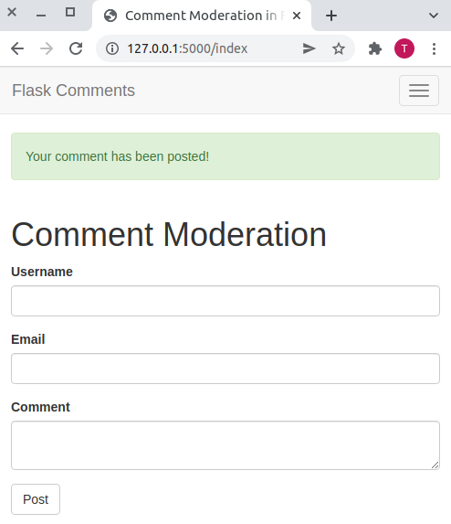
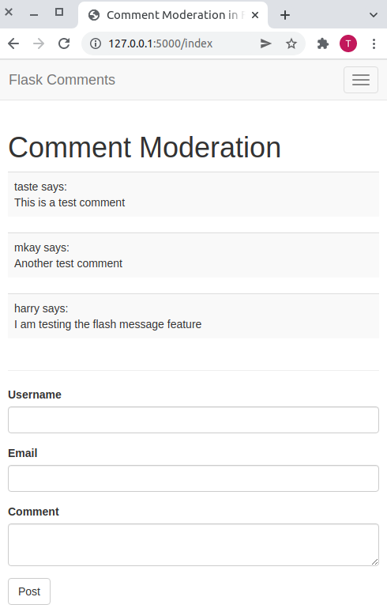
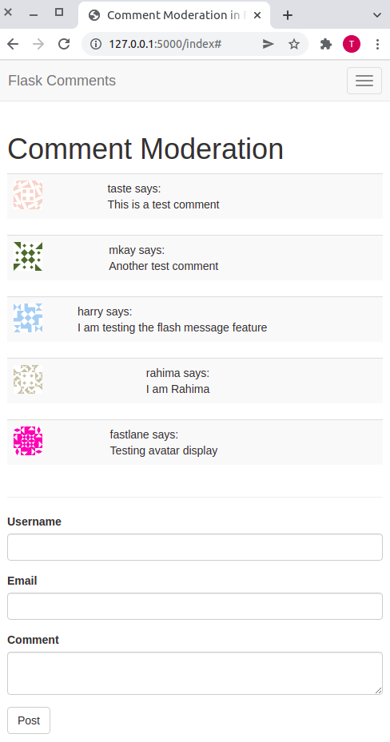
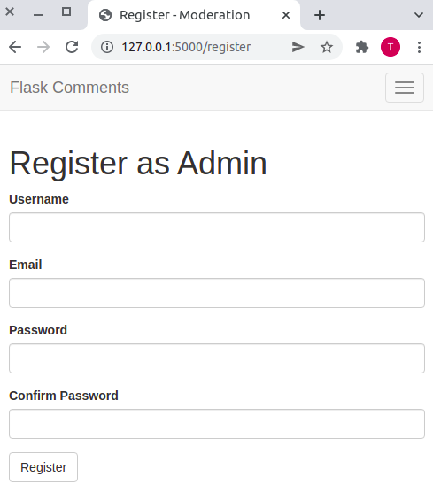
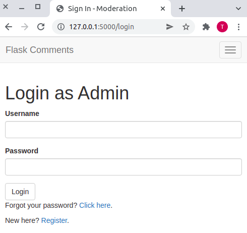
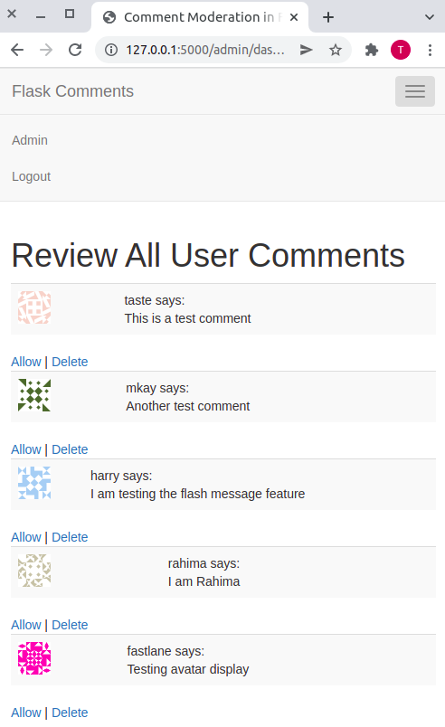

# Moderate User Comments in Flask

As an administrator of a website, one of the things you would really want to do is to moderate what users say publicly to each other. This is a very common task, and having it implemented in your Flask website can really help sanitize the contents. In this tutorial, I will show you how you can implement this feature.

## Create A Simple Flask Application

We will need a simple application to test the Flask server. I have created one already [here](https://github.com/GitauHarrison/starting-a-flask-server). We will build on it and add a comment moderation feature. If you would like to know how the application in the link was built, you can read the [start a flask server tutorial](start_flask_server.md).

## Application Configurations

To receive comments in our application, we need to provided forms that users can fill. The information that users pass through the forms will be used to populate our comments section. So, how can we make forms in Flask?

Flask provides the `flask-wtf` extension, a wrapper around the [WTForms](https://wtforms.readthedocs.io/en/3.0.x/) package. Let us install it in our virtual environment:

```python
(comment_moderation)$ pip3 install flask-wtf
```

As our application grows, certain configurations will be needed. At the moment, we have had no need to use any configuration in our application. Most Flask applications expect certain configurations to be set. One such configuration is the `SECRET_KEY`. It is a variable whose value is a cryptographic key useful in the generation of signatures and tokens. Flask-WTF uses it to protect web forms against a nasty attack called [Cross Site Request Forgery](https://en.wikipedia.org/wiki/Cross-site_request_forgery) or CSRF (pronounced as 'sea-surf'). This value, as the name suggests, is meant to be a secret.

If you look carefully, I have a module called `config` in the top-level directory. Following the principle of _separtion of concerns_, all the configurations that our application will need will be added here.

`config.py: Secret key configuration`
```python
import os


class Config(object):
    # Form
    SECRET_KEY = os.environ.get('SECRET_KEY') or 'you-will-never-guess'

```

I am sourcing the value of `SECRET_KEY` from an environment variable. If the value is missing, I have provided a safe fallback by hardcoding a string. The environment variable is a secret and should not be added to version control. I will create a new file called `.env` which will have the actual value of `SECRET_KEY`. `.gitigonore` file we already have ignores this file from version control, so it is safe to create it in the top-level directory.

```python
(comment_moderation)$ touch .env
```

I will use the following method to generate the value of the SECRET_KEY:

```python
(comment_moderation)$ python3 -c 'import os; print(os.urandom(16))'

# Random Output
b'\x1eh\xfcIWC\x91\xd7\xb3\xfd\x02dK\xe0\xb5z'
```

Hard to guess, right? I will add this value to my environment variable.

`.env: Add secret configuration keys`
```python
SECRET_KEY=b'\x1eh\xfcIWC\x91\xd7\xb3\xfd\x02dK\xe0\xb5z'
```

With the variable set, we can now update our application instance to read and apply our configurations.

`__init__.py: Regiser the config module in application instance`
```python
from flask import Flask
from flask_bootstrap import Bootstrap
from config import Config # < ------------ update

app = Flask(__name__)
app.config.from_object(Config) # < ------------ update

boostrap = Bootstrap(app)

from app import routes, errors

```

I have began by importing the `Config` class from the top-level directory. I have used the `app.config.from_object(Config)` to create an instance of our `Config` class. The lower name `config` comes from python to indicate the `config` module whereas the upper case is the actual `Config` class.

## Flask Web Forms

Another extension that we will use in our application is the `Flask-WTF`. It uses Python classes to represent web forms. The form classes define the variable fields we would like to have in our forms.

### Define Comment Form

Let us begin by creating a simple comment form. The information we want from a user of our application are their username, their email addresses and the content they would like to share on our application. We will begin by creating an empty `forms` module in the `app/` sub-directory.

```python
(comment_moderation)$ touch app/forms.py 
```

Let us now create the class that defines all the fields we want in our comments form.

`forms.py: Create a user comment form`
```python
from flask_wtf import FlaskForm
from wtforms import StringField, SubmitField, TextAreaField
from wtforms.validators import DataRequired, Email


class CommentForm(FlaskForm):
    username = StringField('Username', validators=[DataRequired()])
    email = StringField('Email', validators=[DataRequired(), Email()])
    comment = TextAreaField('Comment', validators=[DataRequired()])
    submit = SubmitField('Post')

```

`flask-wtf` has a base class called `FlaskForm` which is needed. The variable fields are defined using `StringField`, `TextAreaField` and the `SubmitField` from `wtforms`. To ensure that the user does not submit empty data, we attach `DataRequired`. This will prevent them from clicking the `Post` button if any of the fields above are empty. The ```Email``` validator will ensure that the email address is valid.

You will need to install `email-validator` to use the ```Email``` validator.

```python
(comment_moderation)$ pip3 install email-validator
```

### Display Comment Form

The next step is to display this form in our templates. We will use the `index.html` file to display our comment form. 

`index.html`
```html

 <!-- Update -->


    <div class="row">
        <div class="col-md-12">
            <h1>Comment Moderation</h1>
        </div>  
    </div>
    <div class="row">
        <div class="col-md-6">
            {{ wtf.quick_form(form) }} <!-- Update -->
        </div>
    </div>

```

I have used Bootstrap to quicky display my comment form, though you can manually display the same form using raw HTML. 

With the form ready to be displayed, we will now update our `index()` view function to render it.

`routes.py: Render the comments form`

```python
from app import app
from flask import render_template
from app.forms import CommentForm # < ---- update


@app.route('/')
@app.route('/index')
def index():
    form = CommentForm() # < ---- update
    return render_template('index.html', form=form) # < ---- update

```

Start your flask server in the terminal by running the command `flask run`. Navigate to http://127.0.0.1:5000/ to see the comments form displayed.


## Working with a Database

After a user clicks the `Post` button, we will need to store the user data in a database. This data will should persist even if a user closes the application. The database will also allow us to retrieve all the data about our users. 

Since should this application is small in nature, we will use a SQLite database. That does not mean that as the project grows and becomes bigger SQLite will not be a suitable choice. It is still a great choice for bigger applications. Typically, SQLite stores data in a file on the disk, and there is no need to run a datbase server like MySQL and PostreSQL.

Flask provides the `Flask-SQLAlchemy` extension to help us manage our database. It is a Flask-friendly wrapper around the popular SQLAlchemy package. As an [Object Relational Mapper](https://en.wikipedia.org/wiki/Object%E2%80%93relational_mapping), SQLAlchemy is a Python library that allows us to manage our database using classes, objects and methods instead of tables and SQL. The aim of an ORM is to translate these high level operations into database commands.

To install the `Flask-SQLAlchemy` extension, run the following command in the terminal:

```python
(comment_moderation)$ pip3 install flask-sqlalchemy
```

### Database Migrations

Continued use of a database may result in the need to modify the original database schema. We may need to add a new field in the database to now collect users' email addressing, data that originally did not exist. So, when the structure of the database changes, we need to update the database schema by _migrating_ to the modified schema.

We will use `flask-migrate` to perform this migration. Install it in the virtual environment by running the following command in the terminal:

```python
(comment_moderation)$ pip3 install flask-migrate
```


### Database Configuration

SQLite, being the most convinient choice in developing small applications, expects certain configurations from `Flask-SQLAlchemy`. We first provide the location of the database in the application through `SQLALCHEMY_DATABASE_URI` configuration variable. This variable will source its value from the `DATABASE_URL` environment variable.

`config.py: Database Configuration`
```python
import os
basedir = os.path.abspath(os.path.dirname(__file__)) # < ---- update


class Config(object):
    # Form
    SECRET_KEY = os.environ.get('SECRET_KEY') or 'you-will-never-guess'

    # Database
    SQLALCHEMY_DATABASE_URI = os.environ.get('DATABASE_URL') or \
        'sqlite:///' + os.path.join(os.path.dirname(__file__), 'app.db')
    SQLALCHEMY_TRACK_MODIFICATIONS = False
```

If `DATABASE_URL` does not exist, then I have provided a fallback value where I am configuring a database called `app.db` in the top-level directory. The `SQLALCHEMY_TRACK_MODIFICATIONS` configuration option is set to `False` to disable a feature of Flask-SQLAlchemy that tracks every modifications to the database.

### Database Instance

The database will be referenced through a database instance. We will create a `db` variable that will be used to access the database.

`__init__.py: Database Instance`
```python
from flask import Flask
from flask_bootstrap import Bootstrap
from config import Config
from flask_sqlalchemy import SQLAlchemy # < ---- update
from flask_migrate import Migrate # < ---- update

app = Flask(__name__)
app.config.from_object(Config)

boostrap = Bootstrap(app)
db = SQLAlchemy(app) # < ---- update
migrate = Migrate(app, db) # < ---- update

from app import routes, errors, models # < ---- update

```

### Database Models

Our model will contain columns that will store a user's name, email address and comment. All these data are of type `VARCHAR` (in database jargon) and are limited to a specified number of characters. They are basically strings.

Let is create a new module called `models.py` that will contain our database models.

```python
(comment_moderation)$ touch  app/models.py
```

The translation of our database into code will look like this:

`models.py: Comment database Schema`
```python
from app import db
from datetime import datetime


class UserComment(db.Model):
    id = db.Column(db.Integer, primary_key=True)
    username = db.Column(db.String(64), index=True)
    email = db.Column(db.String(120), index=True)
    content = db.Column(db.String(255))
    timestamp = db.Column(db.DateTime, index=True, default=datetime.utcnow)
    user_id = db.Column(db.Integer, db.ForeignKey('user.id'))

    def __repr__(self):
        return 'Comment: {}'.format(self.content)

```

I have added a `timestamp` column to the schema of the `Comment` model. This column will be used to sort the comments by their timestamps. Note how I carefully use `utc.now` and not `utc.now()`. I am passing the function itself and not the result of calling it.

### Database Migration

With every change we might make to the database schema, we would like the flexibility of applying the new changes and work with the modified schema. Also, if we change our mind about the database structure, we should be able to easily roll back to the previous version. As seemingly difficult as it is, we can use the `flask-migrate` extension to do this. `Alembic` maintains a history of the changes that have been made to the database in a _migrations repository_. 

To create a migrations repository, run the following command in the terminal:

```python
(comment_moderation)$ flask db init

# Output 
  Creating directory /home/harry/software_development/python/practice_projects/comment_moderation/migrations ...  done
  Creating directory /home/harry/software_development/python/practice_projects/comment_moderation/migrations/versions ...  done
  Generating /home/harry/software_development/python/practice_projects/comment_moderation/migrations/script.py.mako ...  done
  Generating /home/harry/software_development/python/practice_projects/comment_moderation/migrations/alembic.ini ...  done
  Generating /home/harry/software_development/python/practice_projects/comment_moderation/migrations/README ...  done
  Generating /home/harry/software_development/python/practice_projects/comment_moderation/migrations/env.py ...  done
  Please edit configuration/connection/logging settings in '/home/harry/software_development/python/practice_projects/comment_moderation/migrations/alembic.ini' before proceeding.
```

Remember that the `flask` command relies on the environment variable `FLASK_APP` to determine where our applciation is located. In the top-level directory, you should be able to see a _migrations repository_ which has a _versions_ subdirectory. This folder and all its files are now part of our applications, and should be committed our version control along with all other code.

To create our first migrations script, which will include the comments from our application users, run the following command in the terminal:

```python
(comment_moderation)$ flask db migrate -m "user comment table"

# Output

INFO  [alembic.runtime.migration] Context impl SQLiteImpl.
INFO  [alembic.runtime.migration] Will assume non-transactional DDL.
INFO  [alembic.autogenerate.compare] Detected added table 'user_comment'
INFO  [alembic.autogenerate.compare] Detected added index 'ix_user_comment_email' on '['email']'
INFO  [alembic.autogenerate.compare] Detected added index 'ix_user_comment_timestamp' on '['timestamp']'
INFO  [alembic.autogenerate.compare] Detected added index 'ix_user_comment_username' on '['username']'
INFO  [alembic.autogenerate.compare] Detected removed index 'ix_comment_timestamp' on 'comment'
INFO  [alembic.autogenerate.compare] Detected removed table 'comment'
  Generating /home/harry/software_development/python/practice_projects/comment_moderation/migrations/versions/5fc3f28ab1bc_user_comment_table.py ...  done
```

The `-m` option is used to specify a message that will be included in the migration history. If you check the _versions_ subdirectory, you will notice that we have a new file called `XXX_user_comment_table.py`. This file contains two important functions: `upgrade()` and `downgrade()`. The `upgrade()` function will be called when the migration is applied. The `downgrade()` function will be called when the migration is rolled back.

To apply these changes to the database, run the following command in the terminal:

```python
(comment_moderation)$ flask db upgrade

# Output
INFO  [alembic.runtime.migration] Context impl SQLiteImpl.
INFO  [alembic.runtime.migration] Will assume non-transactional DDL.
INFO  [alembic.runtime.migration] Running upgrade -> 5fc3f28ab1bc, user comment table
```

You will add the migration script to source control and commit it. 

If at any one point you would like to roll back the changes, you can run the `flask db downgrade` command, though this is less likely in a production system.

## Update the Database

Since all user information is now stored in our `User` database which is linked to the `Comment` database, we can now query the database to display all comments. Every time a request to render our index page content is made, we will query the database to display all comments.

The first step is to update our database every time new data comes through the Comments Form. 

`routes.py: Update the database`
```python
from flask.helpers import url_for
from werkzeug.utils import redirect
from app import app, db
from flask import render_template, flash, redirect, url_for
from app.forms import CommentForm
from app.models import UserComment # < ----- update


@app.route('/', methods=['GET', 'POST'])
@app.route('/index', methods=['GET', 'POST'])
def index():
    form = CommentForm()
    if form.validate_on_submit():
        user = UserComment(
            username=form.username.data,
            email=form.email.data,
            content=form.comment.data
        )
        db.session.add(user)
        db.session.commit()
        flash('Your comment has been posted!')
        return redirect(url_for('index'))
    return render_template('index.html', form=form)

```

`form.validate_on_submit()` is used to validate the form. If the form is valid, the `user` object is created and added to the database. Otherwise, the index page will be displayed. I have added a flash message to notify the user that their comment has been posted. To see the message, we need to update our `base.html` template.

`base.html: Show flash message`
```html
<!-- Contents of all our pages will go here -->

    <div class="container">

        
            
                
                    <div class="alert alert-success" role="alert">
                        {{ message }}
                    </div>
                
            
        
        
        
    </div>

```

Try post a comment. If all goes well, then you should be able to see the flash message.



## Display Comments

We will display the comments in the index page. So, let us update our `index()` view function to display the comments.

```python
from flask.helpers import url_for
from werkzeug.utils import redirect
from app import app, db
from flask import render_template, flash, redirect, url_for
from app.forms import CommentForm
from app.models import UserComment


@app.route('/', methods=['GET', 'POST'])
@app.route('/index', methods=['GET', 'POST'])
def index():
    users = UserComment.query.all() # < ----- update
    form = CommentForm()
    if form.validate_on_submit():
        user = UserComment(
            username=form.username.data,
            email=form.email.data,
            content=form.comment.data
        )
        db.session.add(user)
        db.session.commit()
        flash('Your comment has been posted!')
        return redirect(url_for('index'))
    return render_template(
                           'index.html',
                           form=form,
                           users=users # < ----- update
                           )

```

We query our `UserComment` database using the `UserComment.query.all()` function. This function returns a list of all the comments made by users in the database. We can then loop through the list and display the comments in the `index.html` page.

`index.html: Display comments`
```html




    <div class="row">
        <div class="col-md-12">
            <h1>Comment Moderation</h1>
        </div>  
    </div>
    <!-- Display all user comments -->
    <div class="row">
        <div class="col-md-12">
            
                <table class="table table-striped">
                    <tr valign="top">
                        <td>{{ user.username }} says:<br>{{ user.content }}</td>
                    </tr>
                </table>
            
        </div>
    </div>
    <!-- End of displaying user comments -->
    <hr>
    <div class="row">
        <div class="col-md-6">
            {{ wtf.quick_form(form) }}
        </div>
    </div>

```

You should be able to see this:



## User Avatar

So far so good. The last thing I would like to add to every user is an avatar. This avatar will be displayed in each user's comment. To add an avatar to each user, we will need to update our `UserComment` model.

`models.py: User Avatar`
```python
from hashlib import md5

def avatar(self, size):
        digest = md5(self.email.lower().encode('utf-8')).hexdigest()
        return 'https://www.gravatar.com/avatar/{}?d=identicon&s={}'.format(
            digest, size)

```

Here, I am making use of the [gravatar](https://en.gravatar.com/) service to generate an avatar for each user using the `avatar()` functio. This function takes two arguments:

* `self`: The current user object.
* `size`: The size of the avatar.

To request an avatar for a user, a URL of the format `https://www.gravatar.com/avatar/<hash>` is used, where `hash` is the MD5 hash of a user's email address. To generate the MD5 hash, we first convert the email address to lowercase and then encode it using the `utf-8` encoding before passing it to the hash function. You can learn more from the [gravatar documentation](https://gravatar.com/site/implement/images).

We then need to update our table to ensure that a user's avatar is displayed alongside their comments. 

```html

    <table class="table table-striped">
        <tr valign="top">
            <td></td>
            <td>{{ user.username }} says:<br>{{ user.content }}</td>
        </tr>
    </table>

```



## Create An Admin User

Obviously, it is the admin of the website who will have the ability to delete comments. Just as we created the anonymous user, we will create an admin user. But before we do that, I would like to ensure that the admin page is inaccessible to the anonymous user. To do so, I will implement another feature in the application which will allow us to manage user sessions.

### Admin Model

We want to collect an admin's username, email address and the password to their accounts. Our model will define these columns and store the relevant data in the database.

`models.py: Admin model`

```python
# ...
from werkzeug.security import generate_password_hash, check_password_hash


class Admin(db.Model):
    id = db.Column(db.Integer, primary_key=True)
    username = db.Column(db.String(64), index=True)
    email = db.Column(db.String(120), index=True)
    password_hash = db.Column(db.String(128))

    def __repr__(self):
        return 'Admin: {}'.format(self.username)

    def set_password(self, password):
        self.password_hash = generate_password_hash(password)

    def check_password(self, password):
        return check_password_hash(self.password_hash, password)
```

If there is anything that is not clear, please take some time to understand the code above. What I will point out here is the `password_hash` field. It is advised to NEVER store a user's password in the database. Instead, store a representation of it in the form of a hash. This is because a user's password is a sensitive piece of information and we do not want to expose our users to an attacker in the event that the database is compromised.

I am using the `generate_password_hash` to generate a hash of the user's password. This function takes a password as an argument and returns a hash of the password. The `check_password_hash` function is used to check whether a user's password is correct. This function takes a hash and a password as arguments and returns a boolean value. 

Create an admin migration script and apply these changes to our databae.

```python
(comment_moderation) $ flask db migrate -m 'admin table'
(comment_moderation) $ flask db upgrade
```

### Admin Registration

We can now update our `Admin` model by registering a new admin. We will begin by creating an admin registration form.

`forms.py: Admin Registration Form`
```python
from flask_wtf import FlaskForm
from wtforms import StringField, PasswordField, SubmitField
from wtforms.validators import DataRequired, Email


class AdminRegistrationForm(FlaskForm):
    username = StringField('Username', validators=[DataRequired()])
    email = StringField('Email', validators=[DataRequired(), Email()])
    password = PasswordField('Password', validators=[DataRequired()])
    confirm_password = PasswordField('Confirm Password', validators=[DataRequired()])
    submit = SubmitField('Register')

```

With the form created, we will now create a view function which will handle the registration of an admin user.

`routes.py: Admin Registration`
```python
# ...

@app.route('register', methods=['GET', 'POST'])
def register():
    form = AdminRegistrationForm()
    if form.validate_on_submit():
        user = Admin(
            username=form.username.data, email=form.email.data)
        user.set_password(form.password.data)
        db.session.add(user)
        db.session.commit()
        flash('Congratulations, you are now a registered user! Login to contunue.')
        return redirect(url_for('login'))
    return render_template('register.html', title='Register', form=form)
```

Let us create the template that will be used to display the registration form. First, we will create an empty file in the `templates` sub-directory.

```python
(comment_moderation) $ touch app/templates/register.html
```

We will quickly display our form in the template with the help of flask-wtf.

`register.html: Admin Registration Form`
```html




    <div class="row">
        <div class="col-md-12">
            <h1>Register as Admin</h1>
        </div>  
    </div>
    <div class="row">
        <div class="col-md-6">
            {{ wtf.quick_form(form) }}
        </div>
    </div>

```

Navigate to http://127.0.0.1:5000/register to see the registration form.



### Admin Login

Once the admin has been registered, he should be able to login to access their account. This means we need to create a login form and a view function which will handle the login of an admin.

Flask provides the `flask-login` package which we will use to help us manage our user sessions. We will begin by first installing it to our virtual environment.

```python
(comment_moderation) $ pip3 install flask-login
```

Like other extensions, we will initialize it in the application instance.

`__init__.py: Initialize Flask-Login`
```python
# ...
from flask_login import LoginManager

# ...

login = LoginManager()
```

This extension will work with the Admin model, and therefore, expects certain properties and methods to be defined. There are four required items:

* `is_authenticated`: This method returns a boolean value indicating whether the user is authenticated or not.
* `is_active`: This method returns a boolean value indicating whether the user is active or not.
* `is_anonymous`: This method returns a boolean value indicating whether the user is anonymous or not.
* `get_id`: This method returns the user's unique identifier.

`Flask-login` provides a _mixin_ class called `UserMixin`. It will afford us the ability to use generic implementations that are appropriate for our Admin model.

`models.py: Admin model`
```python
# ...

class Admin(UserMixin, db.Model):
    # ...
```

Because `Flask-login` literally knows nothing about databases, it will need the application's help to load the admin. We will use a user loader function to load the admin by their ID.

`models.py: User Loader`
```python
from app import login

@login.user_loader
def load_user(id):
    return Admin.query.get(int(id))
```
With the Admin model fully prepared to handle user sessions, we will now create the login form.

`forms.py: Admin Login Form`
```python
# ...
from wtforms import StringField, SubmitField, PasswordField, BooleanField

class AdminLoginForm(FlaskForm):
    username = StringField('Username', validators=[DataRequired()])
    password = PasswordField('Password', validators=[DataRequired()])
    remember_me = BooleanField('Remember Me')
    submit = SubmitField('Login')
```

The template that will be used to display the login form will be `login.html`. Let us create it and add the code below.

```python
(comment_moderation) $ touch app/templates/login.html # create empty login.html
```

`login.html: Display Admin Login Form`
```html




    <div class="row">
        <div class="col-md-12">
            <h1>Login as Admin</h1>
        </div>  
    </div>
    <div class="row">
        <div class="col-md-6">
            {{ wtf.quick_form(form) }}
            <p>
                Forgot your password? <a href="#">Click here</a>.
            </p>
            <p>
                New here? <a href="{{ url_for('register') }}">Register</a>.
            </p>
        </div>
    </div>

```

Finally, we will create the view function which will handle the login of an admin.

`routes.py: Admin Login`
```python
from flask_login import login_user, current_user, logout_user


@app.route('/login', methods=['GET', 'POST'])
def login():
    if current_user.is_authenticated:
        return redirect(url_for('index'))
    form = AdminLoginForm()
    if form.validate_on_submit():
        user = Admin.query.filter_by(username=form.username.data).first()
        if user is None or not user.check_password(form.password.data):
            flash('Invalid username or password')
            return redirect(url_for('login'))
        login_user(user, remember=form.remember_me.data)
        return redirect(url_for('index'))
    return render_template('login.html', title='Sign In', form=form)
```

To make it easier for an admin to log in to their account, we will display a link in the navigation bar. If you noticed, the login page also contains a link to the registration page. So, there is no need to add a registration link beyond that. I have left out the _forgot password_ link because it is beyond the scope of this tutorial. However, you can take it up as a challenge and learn how you can implement it in the application.

`base.html: Add a login link`
```html

<nav class="navbar navbar-default">
    <div class="container">
        <div class="navbar-header">
            <button type="button" class="navbar-toggle collapsed" data-toggle="collapse" data-target="#bs-example-navbar-collapse-1" aria-expanded="false">
                <span class="sr-only">Toggle navigation</span>
                <span class="icon-bar"></span>
                <span class="icon-bar"></span>
                <span class="icon-bar"></span>
            </button>
            <a class="navbar-brand" href=" {{ url_for('index') }} ">Flask Comments</a>
        </div>
        <div class="collapse navbar-collapse" id="bs-example-navbar-collapse-1">            
            <ul class="nav navbar-nav navbar-right">
                <li><a href=" {{ url_for('login') }} ">Admin</a></li>
            </ul>                       
        </div>
    </div>
</nav>

```

Now, if you click on the Admin link in the navigation bar, you will be redirected to the login page.



### Admin Logout

As an admin, you would want to protect your account by ensuring you log out once you are done moderating user comments. The `logout_user()` method from `flask_login` handles this.

`routes.py: Admin Logout`
```python
# ...

@app.route('/logout')
def logout():
    logout_user()
    return redirect(url_for('login'))
```

We will create a condition in our base template to display the logout link only if the user is logged in.

`base.html: Display logout link`
```html

<nav class="navbar navbar-default">
    <div class="container">
        <div class="navbar-header">
            <button type="button" class="navbar-toggle collapsed" data-toggle="collapse" data-target="#bs-example-navbar-collapse-1" aria-expanded="false">
                <span class="sr-only">Toggle navigation</span>
                <span class="icon-bar"></span>
                <span class="icon-bar"></span>
                <span class="icon-bar"></span>
            </button>
            <a class="navbar-brand" href=" {{ url_for('index') }} ">Flask Comments</a>
        </div>
        <div class="collapse navbar-collapse" id="bs-example-navbar-collapse-1">            
            <ul class="nav navbar-nav navbar-right">
                
                    <li><a href=" {{ url_for('admin_dashboard') }} ">Admin</a></li>
                    <li><a href=" {{ url_for('logout') }} ">Logout</a></li>
                
                    <li><a href=" {{ url_for('login') }} ">Login</a></li>
                
            </ul>                       
        </div>
    </div>
</nav>

```

I have added the admin link to the navigation bar. This link will redirect an admin directly to the dashboard. I will discuss it in the next section below.


### Admin Dashboard

As soon as a new admin has registered, they will access their account by passing in their credentials. If successful, they will be redirected to the admin dashboard. The dashboard will basically have all the posts made by anonymous users of our application together with two _action_ links to _allow_ or _delete_ each comment.

For now, we will display all the user comments just as they can be seen in the index page.

```python
(comment_moderation) $ touch app/templates/admin_dashboard.html # create empty admin_dashboard template
```


`admin_dashboard.html: Display Admin Dashboard`
```html



    <div class="row">
        <div class="col-md-12">
            <h1>Review All User Comments</h1>
        </div>  
    </div>
    <div class="row">
        <div class="col-md-6">
            
                <table class="table table-striped">
                    <tr valign="top">
                        <td></td>
                        <td>{{ user.username }} says:<br>{{ user.content }}</td>
                    </tr>
                </table>

                <span>
                    <a href="#">Allow</a> | <a href="#">Delete</a>
                </span>
            
        </div>
    </div>

```

The view function to render the admin dashboard will be `admin_dashboard()`.

`routes.py: Admin Dashboard`
```python
# ...
from flask_login import login_required


@app.route('/admin/dashboard')
@login_required
def admin_dashboard():
    users = UserComment.query.all()
    return render_template('admin/dashboard.html', users=users)
```

I have added the `login_required` decorator to protect this page from unauthorized access.



## Comment Moderation

We are now ready to implement comment moderation. At the end of this section, our application will only show comments that the admin has approved. To begin, I will add a new field in the `UserComment` model to store the moderation status of a comment.

`models.py: Add comment moderation status`
```python
# ...

class UserComment(db.Model):
    id = db.Column(db.Integer, primary_key=True)
    username = db.Column(db.String(64), index=True)
    email = db.Column(db.String(120), index=True)
    content = db.Column(db.String(255))
    timestamp = db.Column(db.DateTime, index=True, default=datetime.utcnow)
    allowed_comment = db.Column(db.Boolean, default=False) # < ---- new field

# ...
```

I have set the default value of the `allowed_comment` field to `False`. This will ensure that all comments are initially set to `False`.

The next step is to add two view functions to _allow_ and _delete_ each comment.

`routes.py: Allow and Delete Comment`
```python
@app.route('/admin/delete/<int:id>')
def admin_delete(id):
    user = UserComment.query.get_or_404(id)
    db.session.delete(user)
    db.session.commit()
    flash(f'Comment {id} deleted!')
    return redirect(url_for('admin_dashboard'))


@app.route('/admin/allow/<int:id>')
def admin_allow(id):
    user = UserComment.query.get_or_404(id)
    user.allowed_comment = True
    db.session.commit()
    flash(f'Comment {id} allowed!')
    return redirect(url_for('admin_dashboard'))

```

I am identifying each comment by its ID. First, I query the database for first instance of a comment. Once retrieved the `admin_delete()` view function will delete the comment. The `admin_allow()` view function, on the other hand, updates the `allowed_comment` field to `True`. This action changes the status of a comment. Approved comments are those whose status is `True`, and they will be displayed in the `index` page.

To make it work, let us update the admin's dashboard links to include the links to the `admin_delete()` and `admin_allow()` view functions.

`dashboard.html: Add links to admin_delete() and admin_allow()`
```html



    <div class="row">
        <div class="col-md-12">
            <h1>Review All User Comments</h1>
        </div>  
    </div>
    <div class="row">
        <div class="col-md-6">
            
                <table class="table table-striped">
                    <tr valign="top">
                        <td></td>
                        <td>{{ user.username }} says:<br>{{ user.content }}</td>
                    </tr>
                </table>

                <span>
                    <a href=" {{ url_for('admin_allow', id=user.id) }} ">Allow</a> 
                    | 
                    <a href=" {{ url_for('admin_delete', id=user.id) }} ">Delete</a>
                </span>
            
        </div>
    </div>

```

### Display Approved Comments

Let us update our `index()` view function to display only approved comments.

`routes.py: Display Approved Comments`
```python
# ...

@app.route('/', methods=['GET', 'POST'])
@app.route('/index', methods=['GET', 'POST'])
def index():
    users = UserComment.query.filter_by(allowed_comment=True).all() # < ----- update
    form = CommentForm()
    if form.validate_on_submit():
        user = UserComment(
            username=form.username.data,
            email=form.email.data,
            content=form.comment.data
        )
        db.session.add(user)
        db.session.commit()
        flash('Your comment has been posted!')
        return redirect(url_for('index'))
    return render_template(
                           'index.html',
                           form=form,
                           users=users
                           )
```

If you navigate to the index page, you will notice that no comments are being displayed. This is because, at this point, all comments have a default value of `False` for the `allowed_comment` field. To show comments in this page, you will need to _allow_ them from the admin dashboard.


Notice how only one comment appears in the index page whereas the admin dashboard shows all comments.

### Comment Moderation Complete

To ensure that we do not approve a comment twice, I will display an empty link reading _allowed_.

`admin_dashboard.html: Show allowed link`
```html
<span>
    
        <a href=" # ">Allowed</a> 
    
        <a href=" {{ url_for('admin_allow', id=user.id) }} ">Allow</a> 
    
    | 
    <a href=" {{ url_for('admin_delete', id=user.id) }} ">Delete</a>
</span>
```

I have created a condition that checks if the `allowed_comment` field is `True`. If it is, the application will display the `Allowed` link redirecting to nowhere. If it is not, I will display the `Allow` link.


## Conclusion

That is how you can add comment moderation to your flask application. I hope you enjoy this tutorial and find it useful. Do you have any project where you have implemented comment moderation? If so, I will be glad to check it out.