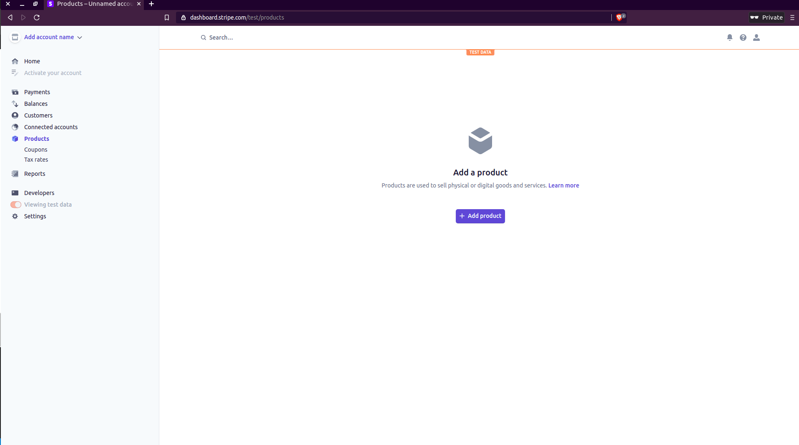
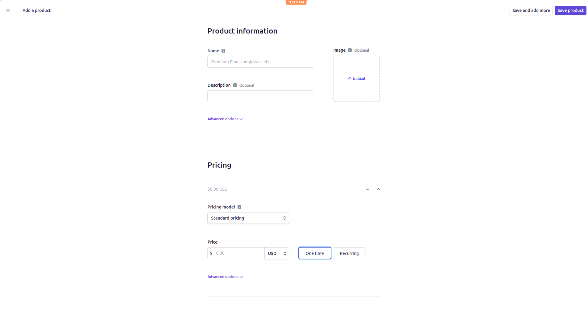

# Stripe For Payment using Python and Flask

Stripe currently has 3 payment strategies for accepting one-time payments:

1. [Charges API](https://stripe.com/docs/payments/charges-api) (legacy)
2. [Stripe Checkout](https://stripe.com/payments/checkout) (We will focus on this)
3. [Payments Intents API](https://stripe.com/docs/payments/payment-intents) 

######  Which strategy should you use?

* Use _Stripe Checkout_ if you want to get up and running fast. It provides a number of powerful features out-of-the-box, supports multiple languages, and can even be used for [recurring payments](https://stripe.com/docs/billing/subscriptions/fixed-price). Most importantly, Checkout manages the entire payment process for you, so you can begin accepting payments without even having to add a single form!
* Use the Payment Intents API (along with Elements) if you want to customize the payment experience for your end users.

###### Workflow

1. Create a project structure to hold all your project resources
2. Create a virtual environment and install `flask`
3. Initialize your app to make sure it is working well (you will display the classic 'Hello, world' message)
4. Add Stripe and its keys
5. Create a product in Stripe
6. Get your Publishable Key
7. Create a [Checkout Session](https://stripe.com/payments/checkout)
8. Redirect the user appropriately when they have checked out
9. Confirm payment with Stripe Webhooks

#### Initial SetUp

You need to create your project directory and move into it. It is important that you activate your [virtual environment](https://docs.python.org/3/tutorial/venv.html) before installing `Flask`. 

Create your project folder and move into it:

```python
$ mkdir flask-stripe-checkout && cd flask-stripe-checkout
```
Create your virtual environment:
```python
$ python3 -m venv tutorial-env
```

If you wish to use a virtualenvironment wrapper to create your virtual environment, learn how to [configure Python Environment with Virtualenvwrapper here](/virtualenvwrapper_setup.md).

Install `flask`
```python
$ pip3 install flask
```
Save your app requirements in a `requirements.txt` file as shown below
```python
$ touch requirements.txt # this will create an empyty file
$ pip3 freeze > requirements.txt
```

###### Simple Flask App Structure

So far, we already have our project folder created and it holds the `requirements.txt` file. We will add the following empty files to complete the structure for our simple app.


```python
(stripe-project)$ mkdir app
(stripe-project)$ touch app/__init__.py # This is where the application is initialized
(stripe-project)$ touch app/routes.py # All our views will be here
(stripe-project)$ touch app.py # this allows for our app to run
(stripe-project)$ touch config # all our configuration variables will be stored here
(stripe-project)$ touch .flaskenv # stores all your environment variables 
(stripe-project)$ mkdir app/templates # create a templates subfolder to hold all our template files
(stripe-project)$ touch app/templates/base.html # base structure of the app will be here
(stripe-project)$ touch app/templates/index.html # this is the primary template
```
Add the following contents to the appropriate files:

`app/__init__.py`
```python
from flask import Flask

app = Flask(__name__)

from app import routes
```

`app/routes.py`
```python
from app import app

@app.route('/')
@app.route('/index')
def index():
    return "Hello, world!"
```

`app.py`
```python
from app import app
```
###### Fire Up Your Server

**Method #1:**

Our app is set up and we need to fire our server to display _Hello, world!_. Let us set up `FLASK_APP` environment variable to import our flask app:

```python
(stripe-project)$ export FLASK_APP=app.py
(stripe-project)$ flask run

# This is what you will see:
* Serving Flask app "app"
* Running on http://127.0.0.1:5000/ (Press CTRL+C to quit)
# click on the link (or copy this http address and paste it in your browser URL bar). You should see Hello, World!
```

**Method #2:**

Since environment variables such as the one created above (I mean `FLASK_APP`) aren't remembered across terminal sessions, you may find it tedious to always have to set the `FLASK_APP` environment variable when you open a new terminal windor. 

Flask allows you to register environment variables that you want to be  automatically imported when you run `flask run` command. To use this option, you have to install the `python-dotenv` package in your activated virtual environment:

```python
(stripe-project)$ pip3 install python-dotenv
```

Register you environment variable in the top-level flaskenv file:

`.flaskenv`
```python
FLASK_APP=app.py
```
Now, all you need to do as run `flask run` and you will be able to see the output in your browser.

#### Adding Stripe

Start by installing `stripe`:

```python
(stripe-project)$ pip3 install stripe
```

[Register](https://dashboard.stripe.com/register) for a stripe account. Once you are in the dashboard, navigate to the _Developers_ menu on the left sidebar. Click on it to reveal _API Keys_.


Click on _API Keys_. 

Each Stripe account has four [API keys](https://stripe.com/docs/keys): two keys for testing and two for production. Each pair has a "secret key" and a "publishable key". Do not reveal the secret key to anyone; the publishable key will be embedded in the JavaScript on the page that anyone can see. 


Currently the toggle for "Viewing test data" in the left sidebar indicates that we're using the test keys now. That's what we want.

Now that we know where to find our API keys, we need to store them in system-wide variables within the top-level `config.py` file.

`config.py`

```python
import os

class Config(object):
    STRIPE_PUBLISHABLE_KEY=<YOUR_STRIPE_PUBLISHABLE_KEY>
    STRIPE_SECRET_KEY=<YOUR_STRIPE_SECRET_KEY>
```

Let us register our configuration in the application package:

`app/__init__.py`

```python
from flask import Flask
from config import Config # new
import stripe # new

app = Flask(__name__)
app.config.from_object(Config) # new

# new
stripe_keys = {
    "secret_key": app.config["STRIPE_SECRET_KEY"],
    "publishable_key": app.config["STRIPE_PUBLISHABLE_KEY"]
}

from app import routes
```

The configuration items can be accessed with a dictionary syntax from `app.config`. Here, you can see a quick session with the Python interpreter where I check what the value of the secret key is:

```python
>>> from app import app
>>> app.config["STRIPE_SECRET_KEY"]

# Your stripe secret key will be displayed here:
<<YOUR_STRIPE_SECRET_KEY>>
```

Finally, you will need to add an account name. Click on the top-left sidebar where it says _Add account name_. You can change the details later in your _Account settings_.


#### Create a Product

We need to create a product to sell. Click _Products_ on the left sidebar in your dashboard and _+Add Product_



Add a product name, enter your price and select _One time_, then click on _Save Product_ on the top-right corner:



#### Get Publishable Key

We will use _Javascript_. We will all a static folder which will hold our `.js` files

```python
(stripe-project)$ mkdir app/static && mkdir app/static/js # this will create a js sub-folder in static
(stripe-project)$ touch app/static/main.js # empty js file
```
`app/static/main.js`
```js
console.log("Sanity check!")
```