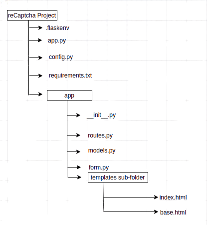
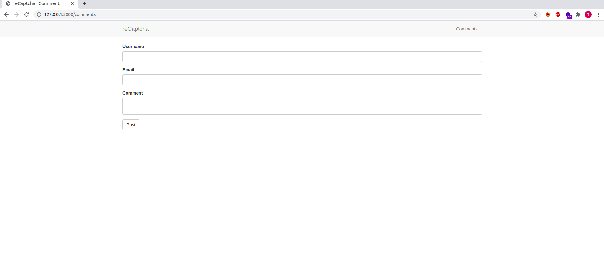
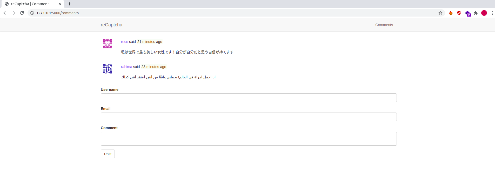

# How to Integrate Google reCaptcha into your Flask Web App

reCAPTCHA is a free service from Google that helps protect websites from spam and abuse. A “CAPTCHA” is a turing test to tell human and bots apart. It is easy for humans to solve, but hard for “bots” and other malicious software to figure out. By adding reCAPTCHA to a site, you can block automated software while helping your welcome users to enter with ease.


##### Overview

To start using reCAPTCHA, you need to sign up for an API key pair for your site. The key pair consists of a site key and secret key. The site key is used to invoke reCAPTCHA service on your site or mobile application. The secret key authorizes communication between your application backend and the reCAPTCHA server to verify the user's response. The secret key needs to be kept safe for security purposes.

##### Things You Will Do

1. Build a simple flask form
2. Sign Up for an API key pair
3. Choose the type of reCAPTCHA and fill in authorized domains or package names
4. Integrate reCAPTCHA into the form

### Build a Simple Flask Form

During this tutorial, you will learn how to integrat reCAPTCHA to a form, because that is where you want to manage user interactions with your app. We will use the structure below to guide us on how to create our simple flask form:




##### Project Structure

So let us go ahead and create this project structure:

```python
$ mkdir reCaptcha-Project # create project folder
$ cd reCaptcha-Project # move into the new folder you have created
$ touch .flaskenv # will hold our environment variables
$ touch app.py # makes our app to run
$ touch config.py # will hold all our configuration variables used in the app
$ touch requirements.txt

# alternatively, you can create all the files above by running:
# touch .flaskenv app.py config.py requirements.txt

$ mkdir app # subdirectory to hold key app resources
$ touch app/__init__.py # application is initialized here
$ touch app/routes.py # will hold all our view functions
$ touch app/models.py # will define our database tables
$ touch app/form.py # we will define our form here
$ mkdir app/templates # subdirectory to hold all templates
$ touch app/templates/base.html # defines all our base features
$ touch app/templates/index.html # form will be displayed here

# Note you can also combine the commands to create 
#all files in a directory as shown in the example above.
```

Now that we have our structure set up, we are going to start building our simple reCaptcha project. We will use `flask` and all its dependancies to achieve this. Things we will need include:

* [flask server](https://flask.palletsprojects.com/en/1.1.x/)
* [flask-wtf](https://flask-wtf.readthedocs.io/en/stable/)
* [flask-sqlalchemy](https://flask-sqlalchemy.palletsprojects.com/en/2.x/)
* [flask migrate](https://flask-migrate.readthedocs.io/en/latest/)
* [flask-bootstrap](https://pythonhosted.org/Flask-Bootstrap/)
* [python-dotenv](https://pypi.org/project/python-dotenv/)

In order for us to install all these packages and the dependancies, it is recommended that you create a virtual environment to isolate your app from your system's ecosystem or possible future dependancies upgrade. 

We will use `pip` to install all our dependancies. Learn what `pip` is [here](https://pypi.org/project/pip/).

##### Create Virtual Environment

To create a virtual environment, we will use a virtual environment wrapper to not only create but also to activate it.

```python
$ mkvirtualenv recaptcha_project

# Your output
created virtual environment CPython3.8.5.final.0-64 in 307ms
  creator CPython3Posix(dest=/home/gitau/.virtualenvs/recaptcha_project, clear=False, global=False)
  seeder FromAppData(download=False, pip=bundle, setuptools=bundle, wheel=bundle, via=copy, app_data_dir=/home/gitau/.local/share/virtualenv)
    added seed packages: pip==20.2.3, setuptools==50.2.0, wheel==0.35.1
  activators BashActivator,CShellActivator,FishActivator,PowerShellActivator,PythonActivator,XonshActivator
virtualenvwrapper.user_scripts creating /home/gitau/.virtualenvs/recaptcha_project/bin/predeactivate
virtualenvwrapper.user_scripts creating /home/gitau/.virtualenvs/recaptcha_project/bin/postdeactivate
virtualenvwrapper.user_scripts creating /home/gitau/.virtualenvs/recaptcha_project/bin/preactivate
virtualenvwrapper.user_scripts creating /home/gitau/.virtualenvs/recaptcha_project/bin/postactivate
virtualenvwrapper.user_scripts creating /home/gitau/.virtualenvs/recaptcha_project/bin/get_env_details

# Your environment is already activated, seen by (recaptcha_project)
(recaptcha_project) gitau@harry:~/recaptcha_project$
```

If you are not familiar with `virtualenvwrapper`, learn how you can install it in your computer [here](virtualenvwrapper_setup.md). 

From now, we will be working within our new virtual environment to really isolate our app during development.

##### Install Flask


```python
(recaptcha_project) gitau@harry:~/recaptcha_project$ pip3 install flask
```

The first time you use `pip`, you may get the soft warning message:

```python
WARNING: You are using pip version 20.2.3; however, version 20.2.4 is available.
You should consider upgrading via the '/home/gitau/.virtualenvs/recaptcha_project/bin/python -m pip install --upgrade pip' command.
```

This should not scare you, rather you should take your time to read the warning message to find out what you can do to solve the issue. From the message we can see that all we need to do is to run the command below to upgrade our `pip`:

```python
(recaptcha_project) gitau@harry:~/recaptcha_project$ pip install --upgrade pip 
# this will upgrade to the latest pip version
```

As soon as `flask` is installed, we need to register it in our application.

app/__init__.py: Create application instance
```python
from flask import Flask

app = Flask(__name__)

from app import routes
```

We have imported our `routes` module at the bottom of our app as a walkaround to _circular imports_ which is a common problem in Flask. Let us now create a _view function_ which will handle the URL to our form.:

app/routes.py: Form Page
```python
from app import app
from flask import render_template

@app.route('/')
@app.route('/comments')
def comments():
    return render_template('comments.html', title = 'Comment')    
```

`render_template` from flask is used to help us display our html page, which we will create next. In order to make our simple app look beautiful and consistent across all web browsers, we will need to install `flask-bootstrap`.

```python
(recaptcha_project) gitau@harry:~/recaptcha_project$ pip3 install flask-bootstrap

# Flask moment helps to format time
(recaptcha_project) gitau@harry:~/recaptcha_project$ pip3 install flask-moment
```

We need to register these two dependancies in our application instance as below:

app/__init__.py: Register Bootstrap
```python
from flask import Flask
# new
from flask_bootstrap import Bootstrap
from flask_moment import Moment

app = Flask(__name__)

# new
bootstrap = Bootstrap(app)
moment = Moment(app)

from app import routes
```

##### Create Page Templates

Now we can create our base template for the application:

app/templates/base.html: Base template
```html


<!-- Title Section -->

    
        <!--Your tab title will look something like: reCaptcha | Comments-->
        reCaptcha | {{ title }} 
    
        reCaptcha
    


<!-- Navbar Section -->

<nav class="navbar navbar-default">
    <div class="container">
        <div class="navbar-header">
            <button type="button" class="navbar-toggle collapsed" data-toggle="collapse" data-target="#bs-example-navbar-collapse-1" aria-expanded="false">
                <span class="sr-only">Toggle navigation</span>
                <span class="icon-bar"></span>
                <span class="icon-bar"></span>
                <span class="icon-bar"></span>
            </button>
            <a class="navbar-brand" href="#">reCaptcha</a>
        </div>
        <div class="collapse navbar-collapse" id="bs-example-navbar-collapse-1">            
            <ul class="nav navbar-nav navbar-right">                                 
                <li><a href=" {{ url_for('login') }} ">Comments</a></li>            
            </ul>                       
        </div>
    </div>
</nav>



    
        
            
                <div class="alert alert-warning" role="alert"> {{ message }} </div>
            
        
    


<!-- Scripts Section -->

    {{ super() }}
    {{ moment.include_moment()}}
    <!-- reCaptcha Integration Will Come Here -->


```

With the base template set up, we can now import all the styles and presentation to our comments form template using `extends` from flask:

app/templates/comments.html: Display comments form

```html




<div class="container">
    <div class="row">
        <div class="col-xs-12 col-sm-12 col-md-12 col-lg-12 col-xl-12">
            {{ wtf.quick_form(form) }}                
        </div>
    </div>
</div>

```
##### Create a Form

First and foremost, we need to configure our app to protect it from an attack called [CSRF](https://en.wikipedia.org/wiki/Cross-site_request_forgery) (Cross-Site Request Forgery), pronounced as 'seasurf'. The Flask-WTF extension uses it to protect web forms against this nasty attack.

app/config.py: Create secret key

```python
import os

class Config(object):
    SECRET_KEY = os.environ.get('SECRET_KEY') or 'you-will-never-guess'
```
Flask and some of its extensions use the value of the secret key as a cryptographic key, useful to generate signatures or tokens. As its name implies, the secret key is supposed to be secret, as the strength of the tokens and signatures generated with it depends on no person outside of the trusted maintainers of the application knowing it.

We need to tell Flask to apply and use SECRET_KEY. To do this, we will register our configuration in the application instance:

app/__init__.py
```python
# previous imports

# new
from config import Config

app = Flask(__name__)
#new
app.config.from_object(Config)

# previous code
```

Flask provides `flask-wtf` which handles all the form requirements. We need to install it in order to create our form:

```python
(recaptcha_project) gitau@harry:~/recaptcha_project$ pip3 install flask-wtf
```

We will use attributes from `flask-wtf` to create all aspects of our form: 

app/forms.py
```python
from flask_wtf import FlaskForm
from wtforms import StringField, TextAreaField, SubmitField
from wtforms.validators import DataRequired, Email

class CommentForm(FlaskForm):
    username = StringField('Username', validators=[DataRequired()])
    email = StringField('Email', validators=[DataRequired(), Email()])
    comment = TextAreaField('Comment', validators=[DataRequired()])
    submit = SubmitField('Post')
```
Due to the email field in our form, flask expects us to install `email-validator` for email validation support:

```python
(recaptcha_project) gitau@harry:~/recaptcha_project$ pip3 install email-validator
```

We need to register the form we have created in the `comments` view function which will be responsible of displaying the form:

app/routes.py: Register form in view function

```python
from app.forms import CommentForm

# previous code 
def comments():
    form = CommentForm()
    if form.validate_on_submit():
        user = User(username = form.username.data, email = form.email.data)        
        post = Comment(body = form.comment.data, author = user)
        db.session.add(user)
        db.session.add(post)
        db.session.commit()
        flash('Your comment is now live!')  
        return redirect(url_for('comments'))  
    posts = Comment.query.order_by(Comment.timestamp.desc()).all()
    return render_template('comments.html', title = 'Comment', form = form, posts = posts)   
```

From our view function above, you can see that I have introduced two new things:
* user
* post

These two variables are responsible for handling the input data from the form and updating our database tables. In a subsequent section below, I will explain how to work with databases.

##### Adding Flask Environment Variables

Flask requires us to create our appication  in the `app.py` file. We need to provide the FLASK_APP environment variable which stores the `app.py` file. Update the file as below:

app.py: Location of Flask application

```python
from app import app
```
Then install the `python-dotenv` dependancy to help us handle all the flask environment variables:
```python
(recaptcha_project) gitau@harry:~/recaptcha_project$ pip3 install python-dotenv
```
We will store all the flask environment variables in the `.flaskenv` file we had created ealier. Add these variables to the file:

.flaskenv: Flask environment variables
```python
FLASK_APP=app.py
FLASK_ENV=development
FLASK_DEBUG=True
```

##### Working with Databases

For the purposes of this simple project, I will resort to use the SQLite database. There are other databases that can be used but for simplicity and for being light, I will use SQLite. There are two dependancies we will need in order to work with SQLite. Go ahead and install them:

```python
(recaptcha_project) gitau@harry:~/recaptcha_project$ pip3 install flask-sqlalchemy
# flask-sqlalchemy will help us work with the SQL database

(recaptcha_project) gitau@harry:~/recaptcha_project$ pip3 install flask-migrate
# flask migrate will help us update our databases every time there is a change
```

As seen before during each import of a dependancy, we need to register the dependancy to the app:

app/__init__.py

```python
# previous imports

from flask_migrate import Migrate
from flask_sqlalchemy import SQLAlchemy

# previous code
db   = SQLAlchemy(app)
migrate = Migrate(app, db)

from app import routes, models
```
We need to update our configurations to effect this new change:

config.py: Flask SQLAlchemy configuration

```python
import os
basedir = os.path.abspath(os.path.dirname(__file__))

class Config(object):
    # ...
    SQLALCHEMY_DATABASE_URI = os.environ.get('DATABASE_URL') or \
        'sqlite:///' + os.path.join(basedir, 'app.db')
    SQLALCHEMY_TRACK_MODIFICATIONS = False
```

##### Database Models

Now, we will create two tables that will will handle user input plus their actual comment. This comment will be displayed within the app right above our comments form.

app/models.py: Create user table
```python
from app import db
from hashlib import md5

class User(db.Model):
    id = db.Column(db.Integer, primary_key=True)
    username = db.Column(db.String(64), index=True, unique=True)
    email = db.Column(db.String(120), index=True, unique=True)

    def __repr__(self):
        return '<User {}>'.format(self.username) 

    def avatar(self, size):
        digest = md5(self.email.lower().encode('utf-8')).hexdigest()
        return 'https://www.gravatar.com/avatar/{}?d=identicon&s={}'.format(digest, size)

```

SQLite saves the database tables locally in a disk by creating a _migration directory_ which stores all the _migration scripts_. The `flask db` sub-command is added by Flask-Migrate to manage everything related to database migrations. So let's create the migration repository and update our database:

```python
# create migration repository
(recaptcha_project) gitau@harry:~/recaptcha_project$ flask db init

# create user tables migration
(recaptcha_project) gitau@harry:~/recaptcha_project$ flask db migrate -m 'user table'

# Apply the changes to the database
(recaptcha_project) gitau@harry:~/recaptcha_project$ flask db upgrade
```

We now have a `user` table which will store a user's _username_ and _email_ information. Next, we need to store the user's comment. We will create a `comment` table:

app/models.py: Create comment table
```python
# previous code

class Comment(db.Model):
    id = db.Column(db.Integer, primary_key=True)
    body = db.Column(db.String(140))
    timestamp = db.Column(db.DateTime, index=True, default=datetime.utcnow)
    user_id = db.Column(db.Integer, db.ForeignKey('user.id'))

    def __repr__(self):
        return '<Post {}>'.format(self.body)
```

Because a comment belongs to a user, we need to show the relationship between the `Comment` table and `User` table. Relational databases excel at creating relationships hence this makes it easier for us to implement relationships between tables:

app/models.py

```python
class User(db.Model):
    # previous code 

    posts = db.relationship('Comment', backref='author', lazy='dynamic')

    def __repr__(self):
        return '<User {}>'.format(self.username)

# Comment Table
```

We need to update these changes to our database:

```python
# create comment migration script
(recaptcha_project) gitau@harry:~/recaptcha_project$ flask db migrate -m 'comment table'

# Apply the changes to the database
(recaptcha_project) gitau@harry:~/recaptcha_project$ flask db upgrade
```

Phew! That was a lot of new stuff put down right there. To understand what is doing on, take your time to go over your scripts to know how everything work together. 

Make sure you update your `routes.py` file to include the form and database tables:

app/routes.py: Updated view function

```python
from app import app, db
from flask import render_template, flash, redirect, url_for
from app.form import CommentForm
from app.models import User, Comment

@app.route('/', methods = ['GET', 'POST'])
@app.route('/comments', methods = ['GET', 'POST'])
def comments():
    form = CommentForm()
    if form.validate_on_submit():
        user = User(username = form.username.data, email = form.email.data)        
        post = Comment(body = form.comment.data, author = user)
        db.session.add(user)
        db.session.add(post)
        db.session.commit()
        flash('Your comment is now live!')  
        return redirect(url_for('comments'))  
    posts = Comment.query.order_by(Comment.timestamp.desc()).all()
    return render_template('comments.html', title = 'Comment', form = form, posts = posts)     
```

At this point, this is what we have:



##### Show User Post

We have all we need for our reCaptcha app to work. Just a few more things to go:

* Creating a post subtemplate
* Including the comments subtemplate in the comments template

Let us add a `_comments.html` subtemplate which we will include in our `comments.html` template to display user posts:

```html
(recaptcha_project) gitau@harry:~/recaptcha_project$ touch app/templates/_comments.html
```

app/templates/_comments.html

```html
<table class="table table-hover">
    <tr valign='top'>
        <td width='70px'>
            
        </td>
        <td>
            <span style="color: #6a8af5;">
                {{ post.author.username }}
            </span>
            said
            <span style="background-color: #f9fcf6;padding: 2px; border-radius: 3px;">
                {{ moment(post.timestamp).fromNow() }}:
            </span><br>
            <br>
            {{ post.body }}            
        </td>
    </tr>
</table>
```
Add `_comments.html` to your main `comments.html` template as below:

app/templates/comments.html

```html




<div class="container">
    <div class="row">
        <div class="col-xs-12 col-sm-12 col-md-12 col-lg-12 col-xl-12">
            <!-- Actual User Comments Go Here -->
            
                
            

            <!-- Comment Form -->
            {{ wtf.quick_form(form) }}                
        </div>
    </div>
</div>

```

At this point all our posts can be seen in our simple app:



### Integrate Google reCaptcha

In order to integrate Google reCAPTCHA in our app, we need to register a site and get an API key pair. Google provides four types of reCAPTCHA.

1. reCAPTCHA v3
2. reCAPTCHA v2
3. Invisible reCAPTCHA
4. reCAPTCHA Android

>reCAPTCHA v3 validates requests with a score whilst v2 validates request with the "I am not a robot" checkbox.

>The Invisible reCAPTCHA does not need the user to click on a check box instead it is called upon when a user clicks on a button on a site.

For now, we will make use of reCAPTCHA v2 to validate requests in our app. If you do not have a [Google Account](https://accounts.google.com/signup/v2/webcreateaccount?flowName=GlifWebSignIn&flowEntry=SignUp), you need to create one. 

##### Things You Need To Do

1. Visit [reCaptcha Home Page](https://www.google.com/recaptcha/about/)
2. Click on [Admin Console](https://www.google.com/recaptcha/admin/create)
3. Fill in your details
* Label: provide any name that will be easy for you to remember
* Choose _reCAPTCHA v2_
* Domains: if you have an actual domain, add it here. If you are using localhost, consider adding: **127.0.0.1**
* Check all boxes
* Submit your information


Upon creation, you will get the registered site API keys. We will add these two keys to our `config.py` file:

config.py: reCaptcha Keys

```python
class Config(object):
    # previous configurations

    # reCAPTCHA configuration
    RECAPTCHA_PUBLIC_KEY = '<your_site_key>'
    RECAPTCHA_PRIVATE_KEY= '<your_secret_key>'
```

Note that you need to name your variables as RECAPTCHA_PUBLIC_KEY and RECAPTCHA_PRIVATE_KEY. Any other names would give you an error.

You will then need to add the reCaptcha js file in `base.html` as done below:

app/templates/base.html

```html
<!-- Scripts Section -->

    <!--Your previous code-->

    <!-- reCaptcha Integration -->
    <script src='https://www.google.com/recaptcha/api.js' async defer></script>

```

Since reCaptcha is part of our from, we need to update our `form.py` file to include reCaptcha:

app/form.py
```python
from flask_wtf import FlaskForm, RecaptchaField
# previous imports

class CommentForm(FlaskForm):
    username = StringField('Username', validators=[DataRequired()])
    email = StringField('Email', validators=[DataRequired(), Email()])
    # new
    comment = TextAreaField('Comment', validators=[DataRequired()])
    recaptcha = RecaptchaField()
    submit = SubmitField('Post')

```

And that is it!! You have reCaptcha as part of your application.


You can update the strength of your reCaptcha in the settings.


##### Update your requirements.txt

With all that work, remember to update your requirements.txt file to include all the dependancies you have used while building this app

```python
(recaptcha_project) gitau@harry:~/recaptcha_project$ pip3 freeze > requirements.txt
```
### Next:

* Learn how you can improve your form by allowing markdown editing [here](handling_rich_text.md).
* Learn how to test your application on localhost from multiple devices [here](localhost_testing.md)