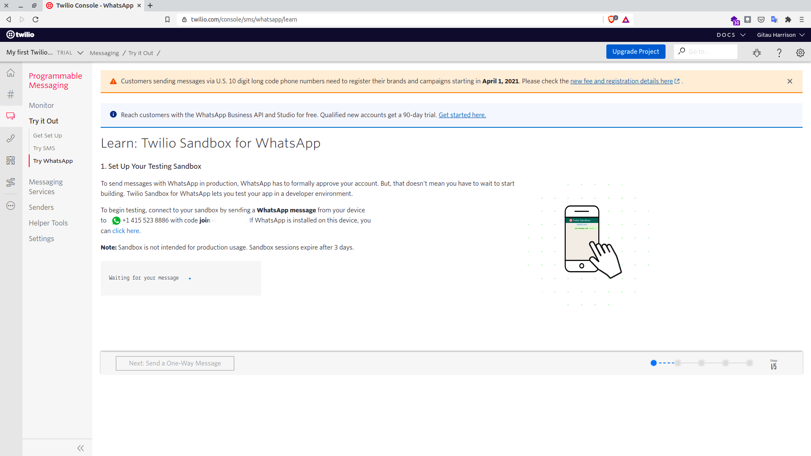
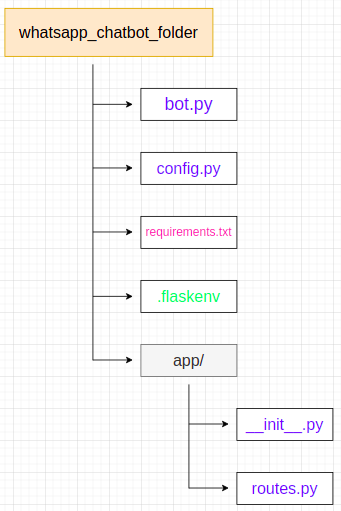
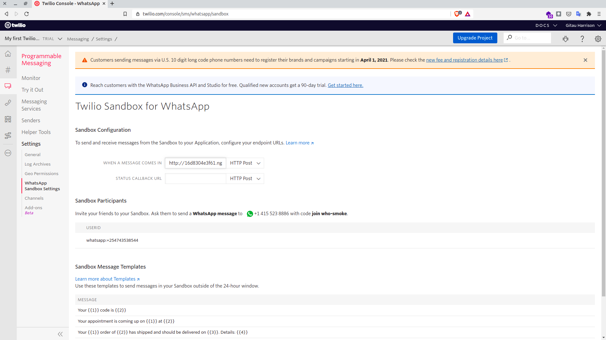

# Build A Simple WhatsApp Chatbot Using Flask and Twilio

A chatbot is a computer program designed to simulate conversation through voice commands or text chats (or both) with human users, especially over the internet. The level of intelligence among chatbots vary immensely, some (like the one used here) are very basic, while others can be very sophisticated by employing machine learning algorithms and artificial intelligence in order to attain near human-level conversation.

## Requirements

These components will be needed for this tutorial:
- Python 3.6 or newer. For y'all on Linux or Ubuntu 20.04, Python comes in the box. If your Operating System does not have Python installed, go to python.org to download a favourable installer.
- [Flask](https://flask.palletsprojects.com/en/1.1.x/) web framework
- Twilio Account. Get [one for free](https://www.twilio.com/try-twilio?promo=WNPWrR) now.
- A smartphone with an active number and WhatsApp installed.
- Ngrok for localhost testing.

**NOTE:** This project assumes you have a basic understanding of flask and a few dependencies. A reference to all components used will be provided in the conclusion section of this article.

## Twilio for WhatsApp

You can easily develop and test your application using the Twilio [WhatsApp Sandbox](https://www.twilio.com/console/sms/whatsapp/learn). The first thing we need to do is to connect our smartphone to the sandbox. From your [Twilio Console](https://www.twilio.com/console),

- Select [Programmable Messaging](https://www.twilio.com/console/sms/dashboard), then
- Click on 'Try It Out', and finally,
- Click on [Try WhatsApp](https://www.twilio.com/console/sms/whatsapp/learn). 



This page provides you with a `join-` code, which is followed by a randomly generated two-word phrase.

Send a WhatsApp message with the given code to the number assigned to your account in order to enable WhatsApp sandbox for your smartphone. Immediately after, you will receiver a response from Twilio indicating that your mobile number is connected to the sandbox. You can now send and receive messages!

## Creating An Application

These are the steps we will follow to create our chatbot:

1. Create application structure
2. Create and activate your virtual environment
3. Install needed packages
4. Build our application
5. Test our application

#### 1. Create Application Structure
Our project will use a very simple structure:



Go ahead and create your project structure using the `mkdir` and `touch` commands in your terminal to create folders and empty files respectively.


#### 2. Create and Activate Virtual Environment

To ensure that we do not clutter our Operating System, we will create and activate a virtual environment:

```python
$ mkvirtualenv whatsapp_chatbot
```

I have used a `virtualenvwrapper` to create my virtual environment. If you are not familiar with `virtualenvwrapper`, learn what it is and how to use it [here](virtualenvwrapper_setup.md).


#### 3. Install Dependancies

It is now recommended to install the dependancies needed for this project inside your virtual environment. These dependencies are:

* flask
* requests
* twilio
* python-dotenv
* pyngrok

To install all of them at once, run:

```python
(whatsapp_chatbot)$ pip3 install flask requests twilio python-dotenv pyngrok
```

For the purposes of demonstration, I have kept this application very simple. All the chatbot does is to determine if two select words come in the conversation. Whenever a user's message includes the word 'quote', the chatbot will respond by giving a random quote. If the user's sentence includes the word 'cat', then an image of cat will be the response from the chatbot. What do you think will happen when a user sends a message that has both words?


#### 4. Build Application

Let us now build our application:

`__init__.py: create application instance`

```python
from flask import Flask

app = Flask(__name__)

from app import routes

```

Above, we have instantiated our application.

`routes.py: Define application endpoint`

```python
from app import app
from flask import request
from twilio.twiml.messaging_response import MessagingResponse
import requests


@app.route('/bot', methods=['POST'])
def bot():
    incoming_msg = request.values.get('Body', '').lower()
    resp = MessagingResponse()
    msg = resp.message()
    responded = False
    if 'quote' in incoming_msg:
        r = requests.get('https://api.quotable.io/random')
        if r.status_code == 200:
            data = r.json()
            quote = f'{data["content"]} ({data["author"]})'
        else:
            quote = 'I could not retrieve a quote at this time, sorry.'
        msg.body(quote)
        responded = True
    if 'cat' in incoming_msg:
        msg.media('https://cataas.com/cat')
        responded = True
    if not responded:
        msg.body('Apologies, I do not understand what you really asked.')
    return str(resp)

```

Our endpoint makes use of the `HTTP POST` method because we will be sending messages out. Each time an incoming message is received from a user, Twilio will invoke this endpoint.

`bot()` function is responsible for analyzing the message sent by a user and provide appropriate responses.

We use the `request` object from flask to deduce the message payload from a user. `.lower()` makes certain that we take care of capitalizatioin or lack thereof in messages by returning all messages in lower case.

The response that Twilio expects from a webhook needs to be given in [Twilio Markup Language (or TwiML)](https://www.twilio.com/docs/glossary/what-is-twilio-markup-language-twiml) based on XML language.

From a message's payload, we extract the body of that message and save it as an object.

The logic employed simply checks where the words 'cat' and 'quote' are in a message. `responded` boolean value tracks for cases where the words are not included, in which case we offer a generic response.

APIs from [Quotable](https://github.com/lukePeavey/quotable) and [Cat as a Service](https://cataas.com/) are used to generate random quotes in json format and random pictures respectively.

Before we can run this application, we need to update `bot.py` file as follows:

```python
from app import app
```

#### 5. Test Application

Envrionment variables are run before our application. Every time we fire up our server, these variables need to be run first. So, what environment variables are these?

```python
FLASK_APP=<value>
FLASK_ENV=<value>
FLASK_DEBUG=<value>

```

We will store all our environment variables in `.flaskenv` file.

`.flaskenv: All environment variable go here`
```
FLASK_APP=bot.py
FLASK_ENV=development
FLASK_DEBUG=True

```

Given that we have built this application following the principle of _separation of concerns_, we can run our application on the terminal:

```python
(whatsapp_chatbot)$ flask run

# Output

* Serving Flask app "bot.py" (lazy loading)
 * Environment: development
 * Debug mode: on
 * Running on http://127.0.0.1:5000/ (Press CTRL+C to quit)
 * Restarting with stat
 * Debugger is active!
```

This application is running on `localhost`. In order to test it, we will use `ngrok` to provide us with a temporary URL that redirects to our local port 5000. Let us update our application to run `ngrok` every time we fire up our server.


`.flaskenv: Add ngrok to environment variables`
```
FLASK_APP=bot.py
FLASK_ENV=development
FLASK_DEBUG=True

START_NGROK=1
```
Ngrok needs to be run every time the server is fired up.

`config.py: Configure ngrok`

```python
import os


class Config(object):
    START_NGROK = os.environ.get('START_NGROK') is not None and \
        os.environ.get('WERKZEUG_RUN_MAIN') is not 'true'

    LOG_TO_STDOUT = os.environ.get('LOG_TO_STDOUT')

```

`__init__.py: Register ngrok configuration in application`

```python
from flask import Flask
from config import Config

app = Flask(__name__)
app.config.from_object(Config)


def start_ngrok():
    from pyngrok import ngrok

    url = ngrok.connect(5000)
    print('* Tunnel: ', url)


if app.config.get("ENV") == "development" and app.config["START_NGROK"]:
    start_ngrok()

from app import routes
```

`ngrok.connect(5000)` is used to connect us to the local port 5000. We then check whether that configuration is set in the `config.py` file. If it is set, then we call the `start_ngrok()` function. A ngork tunnel will be displayed in the terminal every time the application is running. 

```python
# This is how the terminal output will look like:

* Serving Flask app "bot.py" (lazy loading)
 * Environment: development
 * Debug mode: on
 * Running on http://127.0.0.1:5000/ (Press CTRL+C to quit)
 * Restarting with stat
 * Debugger is active!
 * Debugger PIN: 199-894-753
t=2021-03-09T15:17:57+0300 lvl=warn msg="can't bind default web address, trying alternatives" obj=web addr=127.0.0.1:4040
* Tunnel:  NgrokTunnel: "http://16d8304e3f61.ngrok.io" -> "http://localhost:5000"
* Tunnel:  NgrokTunnel: "http://b9d852fc5172.ngrok.io" -> "http://localhost:5000"
```

I am using a free tier package from `ngrok`. Every time I make changes to the application, a new URL will be generated.

Alternatively, open a new window in your terminal and run:

```python
(whatsapp_chatbot)$ ngrok http 5000

# Output

ngrok by @inconshreveable                                                  (Ctrl+C to quit)
                                                                                           
Session Status                online                                                       
Session Expires               1 hour, 59 minutes                                           
Version                       2.3.35                                                       
Region                        United States (us)                                           
Web Interface                 http://127.0.0.1:4041                                        
Forwarding                    http://13c58a13e6c2.ngrok.io -> http://localhost:5000        
Forwarding                    https://13c58a13e6c2.ngrok.io -> http://localhost:5000       
                                                                                           
Connections                   ttl     opn     rt1     rt5     p50     p90                  
                              0       0       0.00    0.00    0.00    0.00
```

Note the lines beginning with 'Forwarding'. These show the public URLs that `ngrok` uses to redirect requests into our service. We now need to tell Twilio to use either of this URLs to send incoming message notifications.

* Go back to [Programmable Messaging](https://www.twilio.com/console/sms/dashboard),
* Click on [Settings](https://www.twilio.com/console/sms/settings), and finally,
* Click on [WhatsApp Sandbox Setting](https://www.twilio.com/console/sms/whatsapp/sandbox)
* Copy the `ngrok` URL and paste it in the box that says 'WHEN A MESSAGE COMES IN'. Remember to append `/bot` since our chatbot is exposed through this endpoint. 
* Make sure to set the request method to `HTTP POST`
* Scroll down and click the 'Save' button
* From _Try It Out/_[Try Whatsapp](https://www.twilio.com/console/sms/whatsapp/learn), you will see a code assigned to you. This code begins with the word `join-`. You will need to use this code to start sending and receiving messages.



You can now start sending messages to the chatbot from the smartphone you connected to the sandbox.

### How to setup your phone to start sending and receiving messages

* Add the phone number +1 415 523 8886  to your contact list.
* Send the code `join-<code>` to the number above. If you have WhatsApp installed, you can [click here](http://wa.me/+14155238886?text=join%20who-smoke).

You can invite your friends to your Sandbox. Ask them to send a WhatsApp Message to the number above with the code shown.

## References

1. If you are not familiar with the flask web framework, learn how you can create and build applications in the [Personal Blog Tutorial](https://gitauharrison-blog.herokuapp.com/personal-blog) series.
2. `virtualenvwrapper` makes working with virtual environments very easy. Learn how to configure your machine to use `virtualenvwrapper` [here](https://gitauharrison-blog.herokuapp.com/virtualenvwrapper).
3. Ngrok is very handy especially  when you want to test an application that is running in the local server. Learn more [here](https://gitauharrison-blog.herokuapp.com/ngrok).