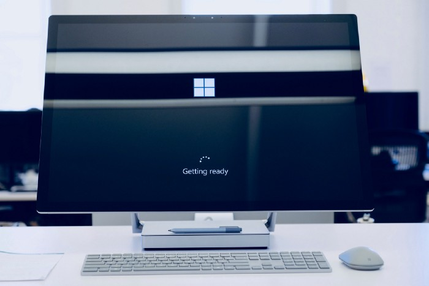
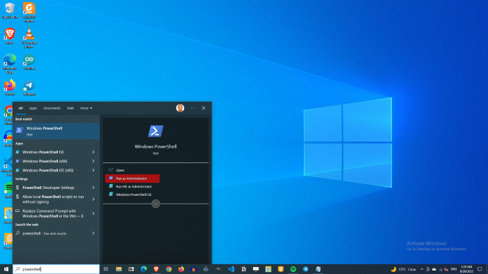
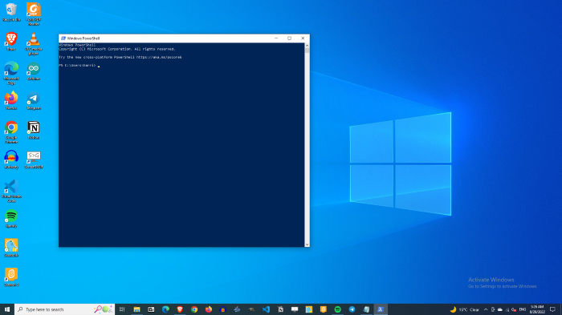
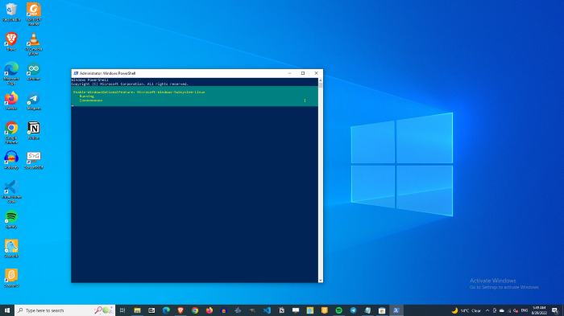
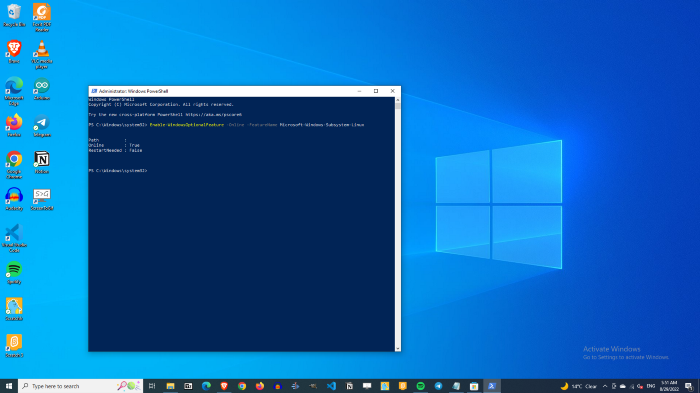
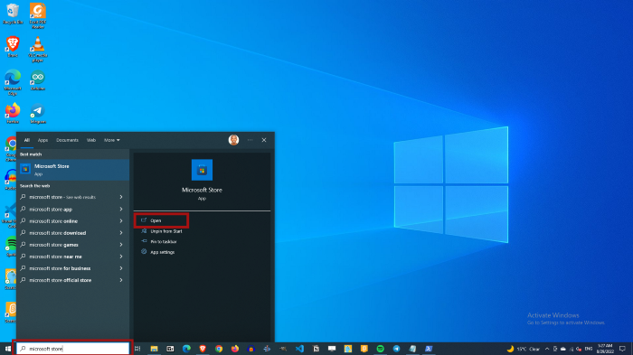
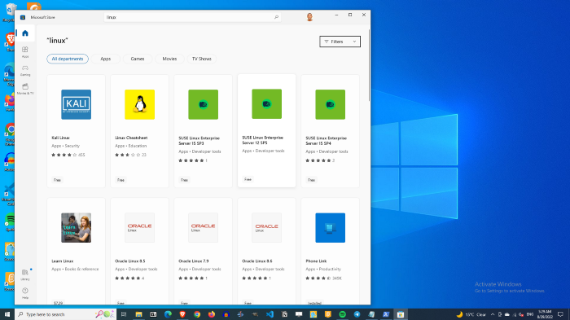
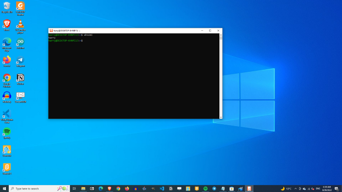
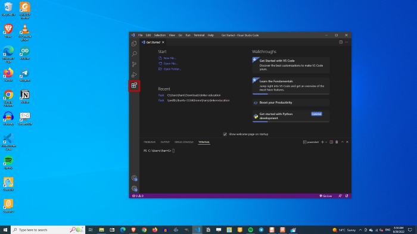
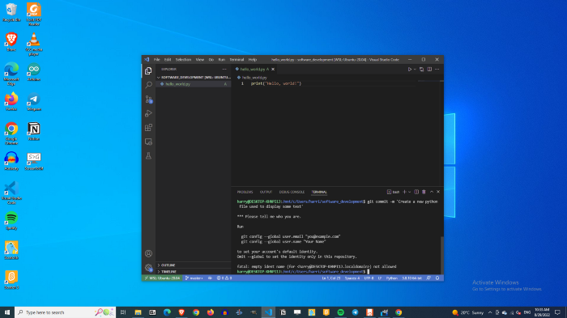

# Get started with the Windows Subsystem for Linux



In this tutorial, you will learn how to enable the Windows Subsystem for Linux (WSL), install your favorite Linux distribution, set up an integrated dev environment with Visual Studio Code, and more.

### Objectives

- Enable the Windows Subsystem for Linux on your Windows device.
- Install a Linux distribution.
- Use Linux commands and work across Windows and Linux file systems.

### Prerequisites

A computer running the current release of Windows 10. To verify that you're running the latest version, go to Settings > Windows Update.

### Table of Contents

1. [Introduction](#introduction)
2. [Enable Windows Subsystem for Linux](#enable-windows-subsystem-for-linux)
3. [Install a Linux Distribution](#install-a-linux-distribution)
4. [Update Your Distribution](#update-your-distribution)
5. [Try A Few Basic Linux Commands](#try-a-few-basic-linux-commands)
6. [Configure Visual Studio Code to Work with WSL](#configure-visual-studio-code-to-work-with-wsl)

## Introduction

As a developer, you have to make a decision on what hardware and development environment you want to use. Traditionally, the advice has been to stick with MacOS or a distribution of Linux. This has been so because these operating systems are easy to install and work with. 

However, Windows has played catch-up by introducing the Windows Subsystem for Linux (WSL). What WSL does is let you run the Linux environment directly on Windows. You don't have to modify anything. What WSL does even better is to let you access your Windows files directly from Bash, and you can seamlessly switch between Windows and Linux by using either Bash or PowerShell.

If you are not aware, PowerShell is much more like the command prompt. The difference between the two is that PowerShell is more powerful, and is cross-platform.

### Benefits of Using WSL

- **Having Linux on top of Windows**: you'll end up with a Linux virtual machine you can run on Windows. You can have any of your favorite distro installed and running at the same time.
- **Run Linux apps as standalone Windows applications**: whether you want to launch Linux apps from the Windows Start menu or pin them to the Windows taskbar, WSL lets you access them from your Windows desktop.
- **Switch between Windows and Linux**: you can switch quickly between Linux and Windows and, perhaps most importantly, access your Windows files and programs from inside the Linux shell. WSL is perhaps the only software that allows Cut and Paste across Windows and Linux apps.
- **Support for cross-platform languages and services**: with WSL in place, you can run advanced programs between two integrated operating systems. These include vim, emacs, NodeJS, Python, Ruby, C/C++, Rust, Go, MySQL, Apache, and MongodB.
- **Supports Windows applications for Linux user habits**: are you a frequent Linux user? Now you can bring your favorite Linux commands to a Windows desktop without having to deal with its user interface. Whether you want to edit a Word file or run Notepad++, you can easily do it the Linux way.

If you are a Windows user, you will need to learn some basic Linux commands to get started.


## Enable Windows Subsystem for Linux

On the Start menu, type PowerShell to pull up the desktop app.



You need to run the app as an administrator. To do this, you can either:
- Select "Run as Administrator" as seen in the image above or
- Right-click Windows PowerShell and select Run as administrator.

After running as an administrator, the Windows PowerShell command window opens.



Copy and paste this script below onto PowerShell to enable the WSL feature:

```python
Enable-WindowsOptionalFeature -Online -FeatureName Microsoft-Windows-Subsystem-Linux
```

Press "Enter" to run the command above.



Once the feature has been enabled, you will see something similar to the image below:



Restart your computer when prompted.


## Install a Linux distribution

Linux has several flavors of operating systems you can choose from. They are referred to as distributions. Choose one that you like. For this tutorial, we will select Ubuntu.

Begin by searching for "Microsoft Store" in the search bar, then click "Open".



Search for Linux (You will see a list Linux distributions in the apps sections).



Find Ubuntu 20.04.4 LTS and click on it.


Click on "Get" as seen in the image above to begin the download process. This file is large and will, therefore, take some time to fully download. After the installation, open Ubuntu 20.04.4. You will automatically get a prompt after the install, but if you missed it, such for Ubuntu in the Start Menu.


You will be prompted to create an account name and password when you run this distribution for the first time. Thereafter, you will be signed in as a non-admin user by default.


If you are not prompted, then run the command below (even in PowerShell) to check your username:

```python
whoami
```



Now that you know your username, by default, your password is your username. If you would like to change this password, you can do so by running:

```python
wsl --user root
```

This command will take you to `root@DESKTOP-KHNPI1J:/mnt/c/Windows/system32#`.From here, type this and then press "Enter":

```
passwd
```

You will be asked to type a password and confirm it. Please do so.


## Update Your Distribution

It is recommended that you update your distribution regularly. Most Linux distributions ship with an almost empty catalog. The first thing you want to do after a fresh install is to update your distribution with the latest packages. As is the case with most Linux users, they prefer to install these updates themselves, hence Windows won't do this for you. To update your Ubuntu distribution, run the following command in the terminal:

```python
sudo apt update && sudo apt upgrade
```


## Try a Few Basic Linux Commands

1. Check which directory you're in by entering `pwd` (print working directory). 
This command gives us the absolute path, which means the path that starts from the root. The root is the base of the Linux file system. It's denoted by a forward slash( / ). The user directory is usually something like /home/username.
2. Enter `ls` to see what files are in the directory of your current path. 
You can see the hidden files by using the command `ls -a`. Displaying the hidden files will reveal the `.bash_history` file, which stores a list of commands you've used recently. (Run the command: `history` to view this list.) You can also use the hidden .bash_logout file to clean up tasks when you log out. Finally, you can use the .bashrc and `.profile` files to customize how your command line appears, declare variables, create aliases or shortcuts, and more.
3. Create a folder using `mkdir` folder_name. 
A folder with the name foldername (you can change this to something more descriptive like _portfolio_project_) will be created at your current location.

Check out [Learn Enough CommandLine to Be Dangerous](https://medium.com/r/?url=https%3A%2F%2Fwww.learnenough.com%2Fcommand-line-tutorial) to get started with basic Linux commands.


## Configure Visual Studio Code to Work with WSL

### Things We Will Do

1. [Download and Install Visual Studio Code (VS Code)](#download-and-install-visual-studio-code-vs-code)
2. [Download and Install Git For Windows](#download-and-install-git-for-windows)
3. [Install VS Code Remote - WSL extension](#install-vs-code-remote-wsl-extension)
4. [Change the Default Terminal Shell to WSL](#change-the-default-terminal-shell-to-wsl)
5. [Create Sample Program](#create-sample-program)
6. [Testing git](#testing-git)

### Download and Install Visual Studio Code (VS Code)

Download Visual Studio Code for Windows: https://code.visualstudio.com. Visual Studio Code is also available for Linux, but we want to install the Windows version so we can edit project files from the Windows OS. You'll still be able to integrate with your Linux distribution's command line and tools.


When you open Visual Studio Code for the first time, you'll probably get an error: Git not found.


### Download and Install Git For Windows

Install it or configure it using 'git.path' setting. You need to install `Git` to power the Source Control panel in the Visual Studio Code workspace. Download and install Git for Windows from the git-scm website by using the included Install Wizard: https://git-scm.com/download/win.


Suppose you are not sure how to install `Git`, double-click on the downloaded file to start the installation process. Alternatively, you can right-click and then select "Run as Administrator" to start.


Follow the prompts until it is fully installed in your machine.


### Install VS Code Remote - WSL extension

In Visual Studio Code, open the Extensions view (select View > Extensions or Ctrl+Shift+X).



Search for "wsl". Choose the Remote - WSL extension as seen below (it should be at the top of the list) and press Install.


The Remote - WSL extension lets you use the Visual Studio Code editor in the context of WSL with full support for language features such as IntelliSense, code navigation, debugging, and more. You can also choose to install the [Remote Development extension pack](https://medium.com/r/?url=https%3A%2F%2Fmarketplace.visualstudio.com%2Fitems%3FitemName%3Dms-vscode-remote.vscode-remote-extensionpack), which bundles all three Visual Studio Code remote extensions to support working over SSH and inside Docker containers in addition to WSL.

### Change the Default Terminal Shell to WSL

The default terminal is PowerShell. To change it, select View > Terminal (or select Ctrl+`, using the backtick character).


A command-line (or terminal shell) window will open at the bottom of your Visual Studio Code window. This window lets you run your command-line tools without leaving Visual Studio Code.


To change the default Visual Studio Code terminal shell, open the terminal dropdown and pick Select Default Shell. A settings window with a list of available shells will open. Select WSL Bash in the list. _(You can also open the default terminal picker from the Command Palette, select the F1 key and enter Terminal: Select Default Shell.)_

If you cannot see this


Then you can go to View > Command Palette


Search for "Terminal default profile"


You will see a list of terminal profiles. Select "Ubuntu 20.04-WSL", or something similar.

Close VS Code and restart it. You should see that the default terminal profile has changed to "wsl" and Ubuntu is loaded on startup.


### Create Sample Program

It is now time to test our setup and configuration thus far. Begin by creating a folder called _software_development_.

```python
mkdir software_development
```

Change the directory into the new folder:

```python
cd software_development
```

Create a sample Python file called _hello_world.py_

```python
touch hello_world.py
```

Update this file with the code below to print the text "Hello, world!":

```python
#hello_world.py
print("Hello, World!")
```

Run the program on your terminal as follows:

```python
python3 hello_world.py
```

I am using Python3 since it is the version available on my Ubuntu user. To check what version of Python you have, run `which python3`. You will see _/usr/bin/python3_.

You should see the text "Hello, world!" printed on the terminal.


## Testing Git

To track _hello_world.py_, you need to first initialize the _software_development_ folder. Run this command in the terminal:

```python
git init
```

You will see the text _Initialized empty Git repository in /mnt/c/Users/harri/software_development/.git/_.


We can now track any changes that will be made on _hello_world.py_. To see that the file is actually being tracked, run this other command in the terminal:

```python
git status
```


The "redness" of our file means that git is tracking it. We can add the new changes we have made in the file by running:

```python
# Track file
git add hello_world.py

# Check tracking status
git status
```

You will see that the file changes from "red" to "green".


Before we can make any more changes to this file, we need to commit it to version control and describe what the change is all about.

```python
git commit -m 'Create a new python file used to display some text'
```

You will notice that the terminal will return an error.



This does not mean that the command we have run is wrong. Git requires us to do a bit more configuration before proceeding. If you would like to learn more on how to use Git, check out these two resources:
- [Install and Configure Git In Ubuntu](https://medium.com/r/?url=https%3A%2F%2Fwww.gitauharrison.com%2Farticles%2Fgithub-ssh)
- [Connect to GitHub Using SSH](https://medium.com/r/?url=https%3A%2F%2Fwww.gitauharrison.com%2Farticles%2Fgithub-ssh)
